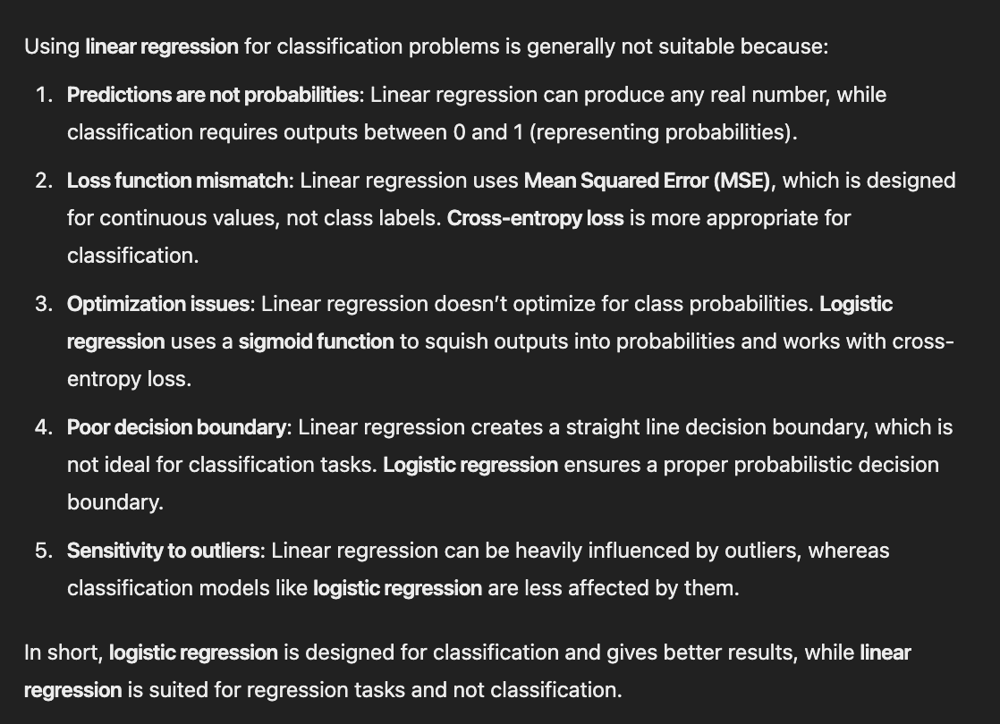
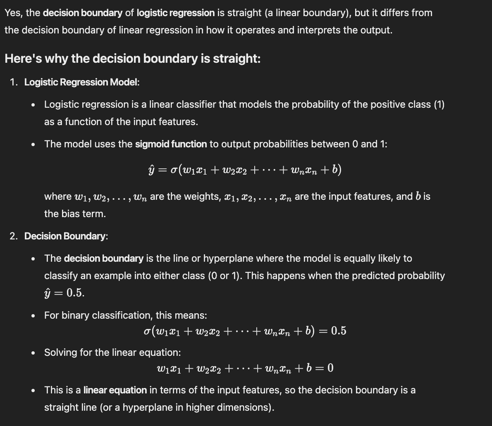

read - https://github.com/zhiqiangzhongddu/Data-Science-Interview-Questions-and-Answers-General-
- reg
    - mle estimate, blue estimator
    - multicollinearity how it affects outcomes
    - duplicate data

- def likelihood

- classification
- trees
- svm
- dim reduction
- outlier detection
- imbalance handling
- feature reduction and regularization
- clustering
- survival analysis
- missing val, how it identify and handle
- loss
    - hinge loss
    - log loss
    - mse
    - clustering loss

